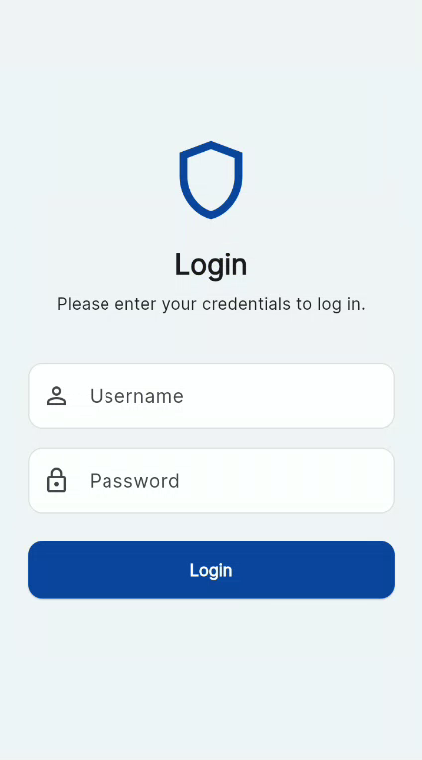
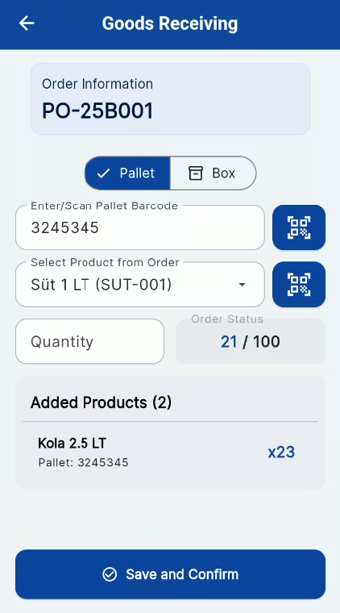

# Diapalet - Mobil Depo Yönetim Sistemi  v1.0.6

Bu proje, Flutter ile geliştirilmiş, Android ve iOS platformlarını destekleyen bir mobil depo yönetim sistemi uygulamasıdır. Uygulama, depo operasyonlarını kolaylaştırmak ve verimliliği artırmak için tasarlanmıştır.

## 🖼️ Ekran Görüntüleri

|                 Giriş Ekranı                  |                   Ana Menü                   |                        Mal Kabul                        |
|:---------------------------------------------:|:--------------------------------------------:|:-------------------------------------------------------:|
|  |  |  |

## ✨ Özellikler

- **Kullanıcı Kimlik Doğrulama:** Güvenli e-posta ve şifre ile giriş.
- **Mal Kabul:**
  - Satın alma siparişlerini listeleme ve arama.
  - Siparişe ait ürünleri ve detaylarını görüntüleme.
  - QR kod okuyucu ile ürünleri ve yerleştirilecek lokasyonları hızlıca tanıma.
- **Envanter Transferi:**
  - **Sipariş Bazlı Transfer:** Belirli bir siparişe ait ürünlerin transferi.
  - **Serbest Transfer:** Siparişten bağımsız olarak ürünlerin bir lokasyondan diğerine taşınması.
  - Palet ve koli bazında transfer işlemleri.
- **Çevrimdışı Desteği:** İnternet bağlantısı olmadığında bile uygulamanın temel işlevlerini kullanabilme. Yapılan işlemler yerel olarak saklanır ve bağlantı sağlandığında otomatik olarak sunucu ile senkronize edilir.
- **Bekleyen İşlemler:** Çevrimdışı modda gerçekleştirilen ve henüz senkronize edilmemiş işlemlerin listesi ve takibi.
- **Çoklu Dil Desteği:** Türkçe ve İngilizce dil seçenekleri.
- **Dinamik Tema:** Cihazın sistem temasına (Açık/Koyu Mod) uyum sağlayan arayüz.

## 🚀 Teknoloji Yığını ve Temel Paketler

- **Frontend:** [Flutter](https://flutter.dev/)
- **Backend:** [PHP](https://www.php.net/)
- **Veritabanı (Mobil):** [SQLite](https://www.sqlite.org/index.html)
- **Mimari:** Feature-based (Özellik bazlı) mimari

### Temel Paketler:
- **State Management:** [provider](https://pub.dev/packages/provider)
- **Dil Desteği:** [easy_localization](https://pub.dev/packages/easy_localization)
- **Veritabanı:** [sqflite](https://pub.dev/packages/sqflite)
- **QR Kod Okuyucu:** [mobile_scanner](https://pub.dev/packages/mobile_scanner)
- **HTTP İstekleri:** [dio](https://pub.dev/packages/dio), [http](https://pub.dev/packages/http)
- **Form Yönetimi:** [flutter_form_builder](https://pub.dev/packages/flutter_form_builder)
- **Asenkron Programlama:** [rxdart](https://pub.dev/packages/rxdart)

## 📂 Proje Yapısı

Proje, sürdürülebilir ve ölçeklenebilir bir kod tabanı sağlamak amacıyla özellik bazlı bir klasör yapısı kullanır.

```
lib/
├── core/         # Paylaşılan widget'lar, servisler, veritabanı, tema vb.
│   ├── local/    # Yerel veritabanı işlemleri (SQLite)
│   ├── network/  # API çağrıları ve ağ yapılandırması
│   ├── sync/     # Çevrimdışı veri senkronizasyon mantığı
│   ├── theme/    # Uygulama tema (açık/koyu mod) yönetimi
│   └── widgets/  # Uygulama genelinde kullanılan ortak widget'lar
├── features/     # Uygulamanın ana özellikleri
│   ├── auth/                 # Kullanıcı kimlik doğrulama işlemleri (giriş, çıkış vb.)
│   ├── goods_receiving/      # Mal kabul modülü (sipariş listeleme, ürün kabul)
│   ├── home/                 # Ana ekran ve menü navigasyonu
│   ├── inventory_transfer/   # Envanter transfer modülü (siparişli/serbest transfer)
│   └── pending_operations/   # Çevrimdışı yapılan ve senkronize edilmeyi bekleyen işlemler
└── main.dart     # Uygulamanın başlangıç noktası
```

## 🏁 Kurulum ve Başlangıç

Projeyi yerel makinenizde çalıştırmak için aşağıdaki adımları izleyin.

### Gereksinimler

- [Flutter SDK](https://flutter.dev/docs/get-started/install) (v3.x.x)
- [PHP](https://www.php.net/manual/en/install.php) ve bir web sunucusu (örn: Apache, Nginx)
- [MySQL](https://dev.mysql.com/doc/mysql-installation-excerpt/5.7/en/) veya [MariaDB](https://mariadb.org/documentation/)

### Kurulum Adımları

1.  **Projeyi klonlayın:**
    ```sh
    git clone https://github.com/YOUR_USERNAME/diapalet.git
    cd diapalet
    ```

2.  **Flutter bağımlılıklarını yükleyin:**
    ```sh
    flutter pub get
    ```

3.  **Backend'i ayarlayın:**
    - `backend/dump.sql` dosyasını veritabanı sunucunuza aktarın.
    - `backend/TerminalController.php` dosyasını ve diğer PHP dosyalarını web sunucunuzun hizmet verdiği bir dizine yerleştirin.
    - PHP dosyalarındaki veritabanı bağlantı ayarlarını kendi yapılandırmanıza göre güncelleyin.

4.  **API yapılandırmasını yapın:**
    - `lib/core/network/api_config.dart` dosyasını, backend servisinizin çalıştığı URL adresi ile güncelleyin.

5.  **Uygulamayı çalıştırın:**
    ```sh
    flutter run
    ```

## 📦 Uygulamayı Derleme (Build)

### Android (.apk)
```sh
flutter build apk --release
```

### iOS (.ipa)
```sh
flutter build ipa --release
```

## ⚙️ Yapılandırma

- **API Uç Noktası:** Uygulamanın iletişim kurduğu ana sunucu adresi `lib/core/network/api_config.dart` dosyasından yönetilir.
- **Yerelleştirme (Localization):** Tüm metinler `assets/lang/` klasörü altındaki `tr.json` ve `en.json` dosyalarında tutulur. Yeni bir dil eklemek için bu klasöre yeni bir `xx.json` dosyası ekleyebilirsiniz.

## 🤝 Katkıda Bulunma

Projeye katkıda bulunmak isterseniz, lütfen issue açın veya pull request gönderin. Katkılarınız projeyi daha iyi bir hale getirecektir!

## 📜 Lisans

Bu proje [MIT Lisansı](https://opensource.org/licenses/MIT) ile lisanslanmıştır. Detaylar için `LICENSE` dosyasına bakınız.
